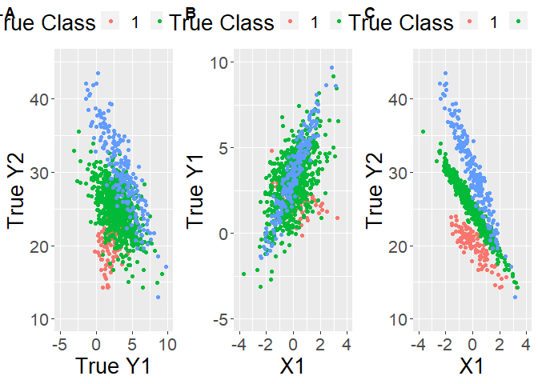

## Installation

You can install singR from github with:

``` r
library(devtools)
install_github("GanzhongTian/R.CenGMR")
```

``` r
library(R.CenGMR)
library(ggplot2)
```

    ## Warning: package 'ggplot2' was built under R version 4.1.3

``` r
library(ggpubr)
```

    ## Warning: package 'ggpubr' was built under R version 4.1.3

Generate of a toy data:

``` r
set.seed(22) 

BETA=list(matrix(c(2,0,20,-2),nrow=2,ncol=2),
          matrix(c(3,1,25,-3),nrow=2,ncol=2),
          matrix(c(3.5,2,30,-5),nrow=2,ncol=2))

SIGMA=list(matrix(c(1,0.1,0.1,1),nrow=2,ncol=2),
           matrix(c(2,0.2,0.2,0.5),nrow=2,ncol=2),
           matrix(c(0.5,0.3,0.3,2),nrow=2,ncol=2))
PIE=c(.1,.7,.2)

message("A vector of Mixing porportions: ")
```

    ## A vector of Mixing porportions:

``` r
print(PIE)
```

    ## [1] 0.1 0.7 0.2

``` r
message("A list of Beta matrices: ")
```

    ## A list of Beta matrices:

``` r
print(BETA)
```

    ## [[1]]
    ##      [,1] [,2]
    ## [1,]    2   20
    ## [2,]    0   -2
    ## 
    ## [[2]]
    ##      [,1] [,2]
    ## [1,]    3   25
    ## [2,]    1   -3
    ## 
    ## [[3]]
    ##      [,1] [,2]
    ## [1,]  3.5   30
    ## [2,]  2.0   -5

``` r
message("A list of Sigma matrices: ")
```

    ## A list of Sigma matrices:

``` r
print(SIGMA)
```

    ## [[1]]
    ##      [,1] [,2]
    ## [1,]  1.0  0.1
    ## [2,]  0.1  1.0
    ## 
    ## [[2]]
    ##      [,1] [,2]
    ## [1,]  2.0  0.2
    ## [2,]  0.2  0.5
    ## 
    ## [[3]]
    ##      [,1] [,2]
    ## [1,]  0.5  0.3
    ## [2,]  0.3  2.0

``` r
example_true_pars=list(PIE,BETA,SIGMA)
names(example_true_pars)=c('PIE','BETA','SIGMA')
#save(example_true_pars,file = "example_true_pars.RData")

example_true=TrueDataGen(1,1000,PIE,BETA,SIGMA)
```

We can visualize the generated data:

``` r
data=example_true[[1]]
data=cbind(data$Y,data$X,data$Labels)
colnames(data)[5]='Labels'
data=as.data.frame(data)

p1=ggplot(data, aes(x=Y1, y=Y2, color=as.factor(Labels))) +
   geom_point() + scale_color_discrete(name = "True Class")+xlab("True Y1")+ylab("True Y2")+
   lims(x= c(-5,10), y = c(10, 45))+theme(legend.position = "top",text = element_text(size = 20))


p2=ggplot(data, aes(x=X1, y=Y1, color=as.factor(Labels))) +
   geom_point() + scale_color_discrete(name = "True Class")+ylab("True Y1")+
   lims(x= c(-4,4), y = c(-5,10))+theme(legend.position = "top",text = element_text(size = 20))


p3=ggplot(data, aes(x=X1, y=Y2, color=as.factor(Labels))) +
   geom_point() + scale_color_discrete(name = "True Class")+ylab("True Y2")+
   lims(x= c(-4,4), y = c(10,45))+theme(legend.position = "top",text = element_text(size = 20))

ggarrange(p1,p2,p3, 
          labels = c("A","B","C"),
          ncol = 3, nrow = 1)
```


